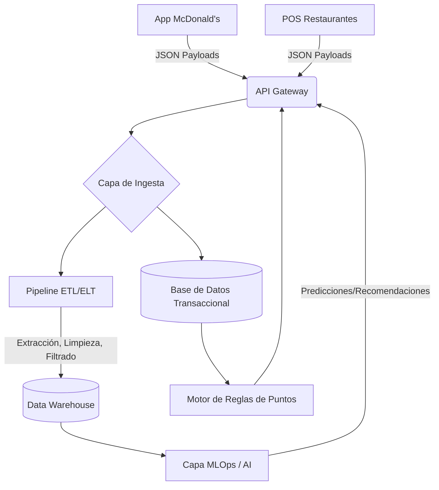
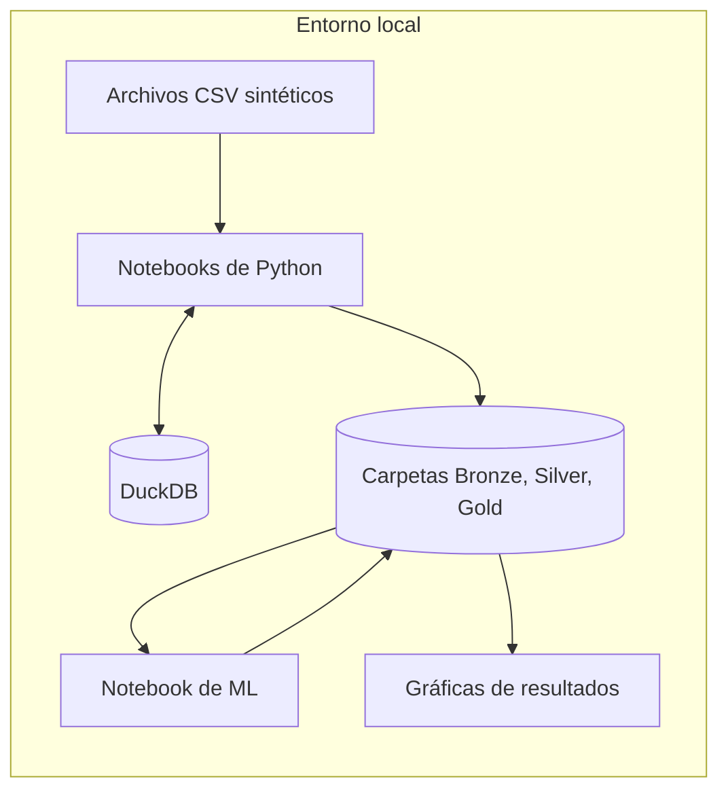
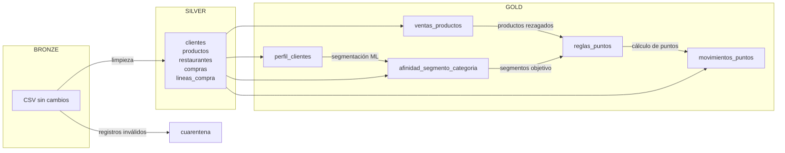
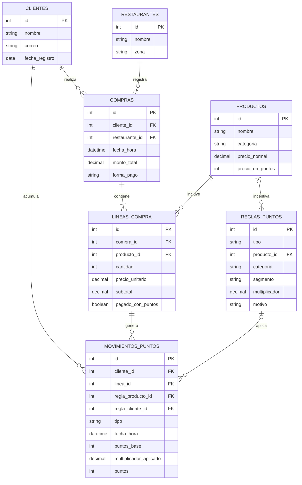

# Caso de Estudio 2: Sistema de Recompensas Dinámico para McDonald's

| Integrante | Carné |
|---|---|
| Nelson García Bravatti | 22434 |
| Ricardo Chuy | 221007 |
| Diego Valenzuela | 22309 |
| Daniel Dubón | 22233 |
| Sergio Orellana | 221122 |
| Joaquín Puente | 22296 |

---

## 1. Resumen de la situación

**Contexto del proyecto:** nuestro equipo de consultores ha sido contratado por McDonald's con el objetivo principal de optimizar su sistema de recompensas basado en puntos. Para lograr esta optimización, es imperativo realizar primero un análisis exhaustivo de la estructura tecnológica actual del programa.

### 1.1 Funcionamiento del programa MiMcDonald's

MiMcDonald's es el programa de fidelización integrado en la aplicación de McDonald's Guatemala. Los usuarios registrados participan automáticamente en el programa y disponen de una tarjeta de lealtad digital identificada mediante un código QR y un código de cliente. Al realizar una compra, el cliente debe identificarse antes de procesar el pago para que la transacción pueda asociarse con su cuenta.

El programa funciona bajo un modelo de acumulación y canje de puntos. Los puntos son personales, no transferibles y no poseen valor monetario. Además de recompensas por puntos, el programa contempla ofertas, cupones, promociones geolocalizadas y campañas temporales.

### 1.2 Acumulación de puntos

McDonald's Guatemala establece una acumulación base de 10 puntos por cada Q1.00 gastado. Para montos inferiores o fraccionarios, los puntos se calculan proporcionalmente y los decimales resultantes se aproximan al entero superior. Los puntos solamente se generan después de que el pago haya sido procesado y pueden tardar hasta 24 horas en aparecer en la cuenta.

Por ejemplo:

| Monto elegible | Puntos base |
| :---: | :---: |
| Q10 | 100 |
| Q25 | 250 |
| Q50 | 500 |
| Q100 | 1,000 |

### 1.3 Problemática

El programa actual usa una regla fija: **cada Q1 gastado equivale a 10 puntos**, sin importar el cliente, el producto, el horario o el canal. Es fácil de entender, pero tiene tres problemas de negocio:

- **No influye en el comportamiento.** Un cliente que ya compra todos los días recibe el mismo incentivo que uno que no ha vuelto en dos meses, así que el programa premia lo que el cliente haría de todas formas.
- **No ayuda a vender lo que cuesta vender.** Los productos de baja rotación, los lanzamientos nuevos o los horarios de poca afluencia no tienen ningún incentivo diferenciado.
- **No aprovecha los datos.** Cada transacción genera información sobre hábitos de compra que hoy solo sirve para sumar un saldo.

La propuesta es pasar de un sistema **estático** a uno **dinámico y personalizado**. El número de puntos que otorga cada producto variará según dos factores: la estrategia comercial (por ejemplo, puntos dobles en productos con baja venta) y el comportamiento del cliente, detectado mediante modelos de Machine Learning.

Esta propuesta se diferencia de las ofertas y cupones que ya existen en MiMcDonald's: las promociones actuales reducen el **precio** de un producto, mientras que el sistema propuesto varía los **puntos que se ganan** y se personaliza para cada cliente.

### 1.4 Objetivo y alcance

**Objetivo general:** proponer un sistema de puntos dinámico que ajuste los puntos otorgados según el producto y el comportamiento del cliente, y validarlo mediante un pipeline de datos.

**Objetivos específicos:**

1. Inferir la arquitectura tecnológica actual del programa MiMcDonald's.
2. Diseñar un modelo de datos y una arquitectura Medallion que soporten puntos dinámicos.
3. Construir una prueba de concepto local con datos sintéticos.
4. Integrar un modelo de segmentación de clientes que, junto con el análisis de ventas, determine qué productos incentivar y para qué clientes.

**Alcance:** el proyecto se concentra en el **pipeline de datos**. La aplicación, los sistemas POS y la API quedan fuera del alcance y se simulan mediante archivos CSV sintéticos. Por simplicidad, la POC se ejecuta en un entorno local; la misma estructura de capas puede trasladarse a una plataforma como Databricks en una implementación productiva.

En este documento primero analizamos la arquitectura tecnológica actual, luego proponemos una arquitectura de datos tipo Medallion, validamos el modelo de datos con una prueba de concepto y describimos cómo integrar los modelos de ML en el pipeline.

---

## 2. Arquitectura del sistema

### 2.1 Arquitectura inferida del sistema actual

A partir del funcionamiento público del programa, inferimos que la arquitectura actual sigue un esquema como el siguiente. Las compras de la app y de los restaurantes llegan a una API central. De ahí pasan a una base de datos transaccional, que mantiene los saldos de puntos, y a un pipeline que alimenta un Data Warehouse para análisis.



Nuestra prueba de concepto se enfoca en la **parte analítica** de esta arquitectura: el pipeline, el Data Warehouse y la capa de ML. Las fuentes de datos (app y POS) se simulan con archivos CSV, como se muestra en la sección 2.2.

### 2.2 Arquitectura de infraestructura de la POC

La arquitectura Medallion es una forma de **organizar los datos por niveles de calidad**, no una tecnología específica. Por eso puede implementarse localmente: cada capa es una carpeta y **DuckDB** funciona como motor de consulta. DuckDB es una base de datos analítica que no necesita servidor ni instalación compleja, lee directamente archivos CSV y Parquet, y permite hacer las transformaciones en SQL, de forma similar a un Data Warehouse.



| Componente | Herramienta | Función |
|---|---|---|
| Datos de origen | Archivos CSV | Simulan las transacciones de McDonald's, un archivo por tabla |
| Capas de datos | Carpetas con archivos CSV y Parquet | Bronze, Silver y Gold, más una carpeta de cuarentena |
| Motor de consulta | DuckDB | Lee, transforma y agrega los datos con SQL |
| Pipeline | Notebooks de Jupyter numerados | Ejecutados en orden, cumplen el papel del orquestador |
| Machine Learning | scikit-learn | Segmentación de clientes con K-means |
| Resultados | Gráficas en el notebook final | Muestran los insights del sistema de puntos |

**Estructura del proyecto:**

```
poc-mcdonalds/
├── data/
│   ├── bronze/       ← CSV sintéticos, sin modificar
│   ├── silver/       ← tablas limpias en Parquet
│   ├── gold/         ← tablas de negocio en Parquet
│   └── cuarentena/   ← registros rechazados en la limpieza
├── notebooks/
│   ├── 01_generar_datos
│   ├── 02_bronze_a_silver
│   ├── 03_silver_a_gold
│   ├── 04_segmentacion_ml
│   └── 05_puntos_e_insights
└── requirements.txt
```

Se usa **Parquet** en Silver y Gold porque, a diferencia del CSV, conserva los tipos de dato (fechas, decimales, enteros).

### 2.3 Arquitectura de datos (Medallion)



- **Bronze:** los CSV tal como se generaron. Sirve de respaldo para reprocesar si algo falla.
- **Silver:** datos limpios. Se eliminan duplicados, montos negativos, campos vacíos y referencias a productos o clientes inexistentes, y se corrigen los tipos de dato. Los registros rechazados se guardan en `cuarentena` para poder revisarlos.
- **Gold:** tablas para el negocio y el modelo, descritas en detalle en la sección 3.3.

El período de datos se divide en dos ventanas: los **meses 1 y 2** sirven para analizar a los clientes y productos y definir las reglas, y el **mes 3** es donde se aplican. Así, las reglas nunca se aplican a las mismas compras que se usaron para crearlas (sección 3.4).

---

## 3. Prueba funcional (POC) del sistema de puntos

### 3.1 Revisión de la base de datos inicial

Propuesta inicial: `clientes` (id, nombre, correo, puntos), `productos` (id, nombre, precio normal, precio con puntos, tipo) y `compras` (id, producto(s), monto total, forma de pago, hora, fecha).

| Problema | Corrección |
|---|---|
| `compras` no tiene `cliente_id`, así que no se sabe a quién asignar los puntos | Agregar `cliente_id` |
| `producto(s)` guarda varios productos en un campo, lo que impide analizar ventas por producto | Crear `lineas_compra`: una compra tiene varias líneas, una por producto |
| `hora` y `fecha` separadas | Unificarlas en `fecha_hora` |
| El saldo de `puntos` no tiene historial | Crear `movimientos_puntos`; el saldo es la suma de los movimientos |
| No hay dónde guardar multiplicadores | Crear `reglas_puntos` |
| No se registra el restaurante | Agregar `restaurante_id` |
| `tipo` es ambiguo | Renombrarlo `categoria` |

### 3.2 Modelo de datos propuesto



Las primeras cinco tablas se generan como CSV, se cargan en Bronze y, una vez limpias, pasan a Silver. Las tablas de Gold las **calcula el pipeline**.

### 3.3 Diccionario de datos

Para cada tabla se indica su capa, su **granularidad** (qué representa una fila) y la descripción de cada columna. Los campos marcados como *opcional* pueden quedar vacíos.

#### Capa Silver

**`clientes`**: clientes registrados en MiMcDonald's. Una fila por cliente.

| Columna | Tipo | Descripción |
|---|---|---|
| id | entero | Identificador único del cliente (PK) |
| nombre | texto | Nombre completo |
| correo | texto | Correo electrónico, único por cliente |
| fecha_registro | fecha | Fecha de alta en el programa; anterior a su primera compra |

**`productos`**: catálogo del menú. Una fila por producto.

| Columna | Tipo | Descripción |
|---|---|---|
| id | entero | Identificador único del producto (PK) |
| nombre | texto | Nombre del producto (ej. "Big Mac", "McFlurry Oreo") |
| categoria | texto | Una de: `hamburguesas`, `pollo`, `desayunos`, `acompañamientos`, `bebidas`, `postres`, `ensaladas` |
| precio_normal | decimal | Precio en quetzales, mayor que 0 |
| precio_en_puntos | entero | Puntos necesarios para canjear el producto |

**`restaurantes`**: puntos de venta. Una fila por restaurante.

| Columna | Tipo | Descripción |
|---|---|---|
| id | entero | Identificador único del restaurante (PK) |
| nombre | texto | Nombre del restaurante |
| zona | texto | Zona o municipio donde se ubica |

**`compras`**: encabezado de cada factura. Una fila por compra.

| Columna | Tipo | Descripción |
|---|---|---|
| id | entero | Identificador único de la compra (PK) |
| cliente_id | entero | Cliente que realizó la compra (FK a `clientes`) |
| restaurante_id | entero | Restaurante donde se realizó (FK a `restaurantes`) |
| fecha_hora | fecha y hora | Momento de la compra, entre 6:00 y 23:00 |
| monto_total | decimal | Total pagado con dinero: suma de los `subtotal` de sus líneas |
| forma_pago | texto | `efectivo` o `tarjeta`. Los canjes con puntos se identifican a nivel de línea |

**`lineas_compra`**: detalle de cada factura. Una fila por producto dentro de una compra.

| Columna | Tipo | Descripción |
|---|---|---|
| id | entero | Identificador único de la línea (PK) |
| compra_id | entero | Compra a la que pertenece (FK a `compras`) |
| producto_id | entero | Producto comprado (FK a `productos`) |
| cantidad | entero | Unidades, mayor o igual a 1 |
| precio_unitario | decimal | Precio cobrado por unidad; 0 si se pagó con puntos |
| subtotal | decimal | `cantidad × precio_unitario` |
| pagado_con_puntos | booleano | Verdadero si la línea fue un canje |

#### Capa Gold

**`perfil_clientes`**: resumen del comportamiento de cada cliente durante la ventana de análisis (meses 1 y 2). Una fila por cliente. Es la entrada del modelo de segmentación.

| Columna | Tipo | Descripción |
|---|---|---|
| cliente_id | entero | Cliente (FK a `clientes`) |
| recencia_dias | entero | Días entre su última compra y la fecha de referencia (último día del mes 2) |
| frecuencia_mensual | decimal | Número de compras dividido entre los meses del período |
| gasto_promedio | decimal | Promedio de `monto_total` de sus compras |
| franja_preferida | texto | Franja con más compras: `mañana` (6–11 h), `almuerzo` (11–15 h), `tarde` (15–18 h), `noche` (18–23 h) |
| categoria_preferida | texto | Categoría que más compra. Es descriptiva: sirve para interpretar los segmentos, no se usa en el modelo |
| segmento | texto | Segmento asignado por el modelo (sección 4.1) |

**`ventas_productos`**: desempeño de cada producto frente a su categoría durante la ventana de análisis. Una fila por producto.

| Columna | Tipo | Descripción |
|---|---|---|
| producto_id | entero | Producto (FK a `productos`) |
| categoria | texto | Categoría del producto |
| unidades_vendidas | entero | Unidades vendidas con dinero en el período |
| ingresos | decimal | Suma de `subtotal` del producto |
| promedio_categoria | decimal | Promedio de unidades vendidas de los productos de su categoría |
| indice_ventas | decimal | `unidades_vendidas / promedio_categoria`. 1 = vende como el promedio de su categoría |
| es_rezagado | booleano | Verdadero si `indice_ventas` es menor que el umbral de rezago (sección 3.4) |

**`afinidad_segmento_categoria`**: qué tanto compra cada segmento cada categoría durante la ventana de análisis. Una fila por combinación de segmento y categoría.

| Columna | Tipo | Descripción |
|---|---|---|
| segmento | texto | Segmento de clientes |
| categoria | texto | Categoría de productos |
| pct_compras_segmento | decimal | Porcentaje de las compras del segmento que incluyen al menos un producto de la categoría |
| pct_compras_total | decimal | Porcentaje de todas las compras que incluyen al menos un producto de la categoría |
| indice_afinidad | decimal | `pct_compras_segmento / pct_compras_total`. Mayor que 1 = el segmento compra la categoría más que el promedio |

La afinidad se mide por categoría y no por producto porque los productos rezagados venden poco por definición: su afinidad individual se calcularía con muy pocas compras y no sería confiable.

**`reglas_puntos`**: multiplicadores vigentes. Una fila por regla.

| Columna | Tipo | Descripción |
|---|---|---|
| id | entero | Identificador único de la regla (PK) |
| tipo | texto | `producto` (aplica a ciertos productos o categorías) o `cliente` (aplica a cualquier compra de un segmento) |
| producto_id | entero | *Opcional.* Producto al que aplica (FK a `productos`) |
| categoria | texto | *Opcional.* Categoría a la que aplica, si la regla no es de un producto específico |
| segmento | texto | *Opcional.* Segmento al que va dirigida. Vacío = todos los clientes |
| multiplicador | decimal | Factor que se aplica sobre los puntos base, mayor que 1 |
| motivo | texto | Justificación de la regla (ej. "producto rezagado con alta afinidad en segmento Leales") |

**`movimientos_puntos`**: historial de puntos de todo el período. Una fila por acumulación o canje, asociada a una línea de compra. En los meses 1 y 2 solo se aplica la regla fija; las reglas dinámicas se aplican a partir del mes 3.

| Columna | Tipo | Descripción |
|---|---|---|
| id | entero | Identificador único del movimiento (PK) |
| cliente_id | entero | Cliente dueño de los puntos (FK a `clientes`) |
| linea_id | entero | Línea de compra que originó el movimiento (FK a `lineas_compra`) |
| regla_producto_id | entero | *Opcional.* Regla de tipo `producto` aplicada (FK a `reglas_puntos`) |
| regla_cliente_id | entero | *Opcional.* Regla de tipo `cliente` aplicada (FK a `reglas_puntos`) |
| tipo | texto | `acumulacion` o `canje` |
| fecha_hora | fecha y hora | Fecha y hora de la compra de origen |
| puntos_base | entero | Puntos con la regla fija: `subtotal × 10`, redondeado hacia arriba por línea. 0 en canjes |
| multiplicador_aplicado | decimal | Producto de los multiplicadores aplicados, limitado por el tope. 1 si no aplica ninguno |
| puntos | entero | Puntos finales, redondeados hacia arriba. Negativo en canjes: `-(precio_en_puntos × cantidad)` |

La diferencia entre `puntos` y `puntos_base` en el mes 3 permite medir el costo adicional del sistema dinámico frente a la regla fija.

### 3.4 Parámetros de la POC

| Parámetro | Valor | Uso |
|---|---|---|
| Puntos por quetzal | 10 | Regla base del programa actual |
| Redondeo | Entero superior, por línea | Igual que el programa actual |
| Umbral de rezago | `indice_ventas` < 0.5 | Un producto vende menos de la mitad del promedio de su categoría |
| Umbral de afinidad | `indice_afinidad` > 1.2 | Un segmento compra la categoría al menos 20 % más que el promedio |
| Tope de multiplicador | x3 | Máximo multiplicador combinado por línea |
| Número de segmentos | 4 | Grupos del modelo K-means |
| Ventana de análisis | Meses 1 y 2 | Datos para perfiles, segmentos, ventas, afinidad y reglas |
| Ventana de aplicación | Mes 3 | Compras a las que se aplican las reglas dinámicas |
| Fecha de referencia | Último día del mes 2 | Base para calcular la recencia |

**Reglas de aplicación:**

- Si varias reglas de tipo `producto` aplican a una línea, se usa la de mayor multiplicador.
- Cada cliente recibe como máximo una regla de tipo `cliente`, la de su segmento.
- El multiplicador final es el producto de ambas reglas, sin superar el tope.
- Las líneas pagadas con puntos no generan acumulación.

### 3.5 Datos sintéticos

Se genera un CSV por tabla de Silver: `clientes.csv`, `productos.csv`, `restaurantes.csv`, `compras.csv` y `lineas_compra.csv`.

| Tabla | Volumen sugerido |
|---|---|
| clientes | 1,000 |
| productos | 20 a 30 |
| restaurantes | 10 |
| compras | 20,000 (3 meses) |
| lineas_compra | 1 a 4 por compra |

Para que la POC tenga sentido, el generador crea los clientes a partir de **cuatro perfiles de comportamiento** que corresponden a los segmentos esperados (sección 4.1):

| Perfil generado | Comportamiento simulado |
|---|---|
| Leales | Varias compras por semana, ticket alto, todas las franjas |
| Madrugadores | Compran casi solo entre 6 y 11 h, sobre todo desayunos y bebidas |
| En riesgo | Compran seguido en el mes 1 y casi nada en el mes 2 |
| Ocasionales | Una o dos compras al mes, ticket bajo |

El modelo no conoce estos perfiles: debe redescubrirlos a partir de los datos. Esto demuestra que el pipeline es capaz de detectar esos patrones.

Además, el generador debe cumplir estas condiciones:

- **Productos rezagados:** 3 o 4 productos venden mucho menos que el resto de su categoría.
- **Preferencias por categoría:** cada perfil compra algunas categorías más que otras, para que exista afinidad.
- **Canjes coherentes:** solo se generan canjes cuando el cliente tiene saldo suficiente con la regla fija.
- **Registros con errores:** duplicados, montos negativos y productos inexistentes, para demostrar la limpieza en Silver.

### 3.6 Procedimiento

Cada paso corresponde a un notebook; ejecutarlos en orden equivale a correr el pipeline completo.

1. **Generación (01):** crear los CSV sintéticos en `data/bronze/`.
2. **Silver (02):** limpiar y validar los datos con DuckDB; guardar las tablas limpias en `data/silver/` y los registros rechazados en `data/cuarentena/`.
3. **Gold (03):** con los meses 1 y 2, calcular `perfil_clientes` (sin segmento) y `ventas_productos`.
4. **ML (04):** segmentar a los clientes, completar la columna `segmento` y calcular `afinidad_segmento_categoria` con los meses 1 y 2 (sección 4).
5. **Puntos e insights (05):** generar `reglas_puntos`, calcular `movimientos_puntos` (regla fija en los meses 1 y 2, reglas dinámicas en el mes 3) y comparar ambos sistemas en el mes 3.

**Fórmula por línea de compra:**

> puntos = subtotal × 10 × multiplicador de producto × multiplicador de cliente

El resultado se redondea al entero superior en cada línea, igual que en el programa actual. La regla base de 10 puntos por quetzal se mantiene y los multiplicadores solo suman.

**Compatibilidad con la operación actual:** como MiMcDonald's ya acredita los puntos hasta 24 horas después de la compra, un pipeline que calcula los puntos una vez al día es compatible con la forma en que el programa opera hoy.

### 3.7 Validaciones

| # | Caso | Resultado esperado |
|---|---|---|
| 1 | Registros con errores | No llegan a Silver; quedan en cuarentena |
| 2 | Compra de Q50 sin multiplicadores | 500 puntos |
| 3 | Compra de una sola línea de Q12.35, sin multiplicadores | 124 puntos (123.5 redondeado hacia arriba) |
| 4 | Producto rezagado de Q15 con x2 | 300 puntos |
| 5 | Cliente con regla x1.5 que compra un producto con regla x2 | Multiplicador x3 (1.5 × 2), dentro del tope |
| 6 | Combinación que supera el tope (ej. x2 × x2) | Multiplicador limitado a x3 |
| 7 | Línea pagada con puntos | Movimiento de canje negativo; no genera acumulación |
| 8 | Compra de un cliente con regla, realizada en el mes 1 o 2 | Solo recibe los puntos de la regla fija |
| 9 | Saldos | Ningún cliente queda en negativo |

---

## 4. Integración de ML en el pipeline

### 4.1 Modelo de segmentación

El notebook 04 toma la tabla `perfil_clientes` y aplica **K-means** (scikit-learn), un algoritmo que agrupa a los clientes con hábitos parecidos. Las variables son:

- recencia (días desde la última compra);
- frecuencia (compras por mes);
- gasto promedio;
- franja preferida.

Antes de entrenar, la franja preferida se convierte en columnas numéricas (una por franja), porque K-means solo trabaja con números, y todas las variables se estandarizan para que ninguna domine por su escala.

K-means entrega grupos numerados, sin nombre. El equipo revisa las características promedio de cada grupo, incluida la categoría preferida, y le asigna el nombre que mejor lo describe:

| Segmento | Comportamiento | Incentivo propio |
|---|---|---|
| Leales | Compran seguido y gastan bien | Ninguno adicional: ya compran seguido, así que solo reciben los multiplicadores de productos rezagados (sección 4.2) |
| Madrugadores | Compran casi solo en la mañana | Tipo `producto`: x2 en categorías de almuerzo (hamburguesas y pollo) |
| En riesgo | Compraban seguido y dejaron de hacerlo | Tipo `cliente`: x1.5 en cualquier compra |
| Ocasionales | Compran poco | Tipo `cliente`: x1.25 en cualquier compra |

### 4.2 Asignación de multiplicadores

Además del incentivo propio de cada segmento, `reglas_puntos` incluye reglas para los productos rezagados, que se obtienen combinando dos análisis:

1. **Qué productos incentivar:** los marcados como `es_rezagado` en `ventas_productos`. Se comparan dentro de su categoría porque una ensalada no debe medirse contra una hamburguesa.
2. **A quién dirigir el incentivo:** los segmentos cuyo `indice_afinidad` con la categoría del producto supera el umbral. Así el multiplicador llega a los clientes con más probabilidad de responder, en lugar de aplicarse a todos.

Este mecanismo aplica a cualquier segmento. Por ejemplo, si un postre vende poco y los clientes "Leales" compran postres más que el promedio, el x2 de ese postre se dirige a los Leales. Si ningún segmento muestra afinidad con la categoría, la regla se aplica a todos los clientes.

El flujo completo es: **Silver → perfil de clientes → segmentación → afinidad con productos → reglas de puntos → cálculo de puntos**. El modelo propone a quién incentivar y el cálculo aplica los topes, así cada punto se puede explicar.

### 4.3 Insights esperados

| Insight | Pregunta que responde | Tabla de origen |
|---|---|---|
| Perfil de los segmentos | ¿Qué tipos de clientes hay, cuántos son y cómo compran? | `perfil_clientes` |
| Productos rezagados | ¿Qué productos necesitan impulso dentro de su categoría? | `ventas_productos` |
| Afinidad segmento–categoría | ¿A qué clientes conviene dirigir cada incentivo? | `afinidad_segmento_categoria` |
| Costo del sistema dinámico | ¿Cuántos puntos adicionales otorga frente a la regla fija, y en qué productos y segmentos se concentran? | `movimientos_puntos` |

Estos insights responden **qué productos incentivar y para quién**. Si los incentivos realmente aumentan las ventas no se puede demostrar con datos sintéticos; eso requiere un piloto con clientes reales.

### 4.4 Siguientes pasos (fuera de la POC)

- Migrar el pipeline a una plataforma como Databricks para trabajar con datos reales y a mayor escala.
- Registrar y versionar los modelos con MLflow.
- Aplicar multiplicadores por horario en productos que venden poco en ciertas franjas del día.
- Incorporar el margen de cada producto para priorizar los rezagados más rentables.
- Predecir qué clientes dejarán de comprar antes de que ocurra.
- Medir el impacto real con un piloto y un grupo de control que mantenga la regla fija.
- Usar un LLM para redactar mensajes personalizados sobre los puntos extra.

### 4.5 Indicadores de éxito (en un piloto)

- **Frecuencia de visita:** si los clientes vuelven más seguido.
- **Ticket promedio:** si compran más por visita.
- **Ventas de los productos incentivados:** si los multiplicadores mueven los productos rezagados.
- **Costo en puntos del programa:** si el sistema sigue siendo rentable.

---

## 5. Conclusiones

1. La regla fija de Q1 = 10 puntos recompensa el consumo, pero no lo motiva. Los puntos dinámicos lo convierten en una herramienta para impulsar productos y hábitos específicos.
2. La arquitectura Medallion es una forma de organizar los datos, independiente de la tecnología. Implementarla localmente con carpetas y DuckDB mantiene la POC simple, y la misma estructura puede migrarse a una plataforma como Databricks.
3. El modelo de datos inicial necesitaba el cliente en cada compra, líneas de compra, historial de puntos y reglas. Sin las líneas de compra no es posible medir el efecto por producto.
4. La combinación de ventas por categoría y afinidad entre segmentos y categorías permite decidir qué productos incentivar y a quién, con una segmentación simple con K-means y consultas de agregación.
5. Como el programa actual ya acredita los puntos en diferido, un cálculo diario de puntos dinámicos puede integrarse sin cambiar la experiencia del cliente.
6. Separar una ventana de análisis y una de aplicación evita que las reglas se evalúen sobre las mismas compras que las originaron.
7. Con datos sintéticos, la POC demuestra que el pipeline funciona y qué incentivos asignar. El impacto real en ventas debe confirmarse con un piloto.

---

## 6. Referencias

- Databricks. (s. f.). *What is a medallion architecture?* https://www.databricks.com/glossary/medallion-architecture
- Hughes, A. M. (2012). *Strategic database marketing* (4.ª ed.). McGraw-Hill.
- Kimball, R., & Ross, M. (2013). *The data warehouse toolkit: The definitive guide to dimensional modeling* (3.ª ed.). Wiley.
- McDonald's Guatemala. (s. f.). *Términos y condiciones del programa MiMcDonald's*. [Agregar URL consultada]
- Pedregosa, F., et al. (2011). Scikit-learn: Machine learning in Python. *Journal of Machine Learning Research, 12*, 2825–2830.
- Raasveldt, M., & Mühleisen, H. (2019). DuckDB: An embeddable analytical database. *Proceedings of the 2019 International Conference on Management of Data (SIGMOD)*, 1981–1984.