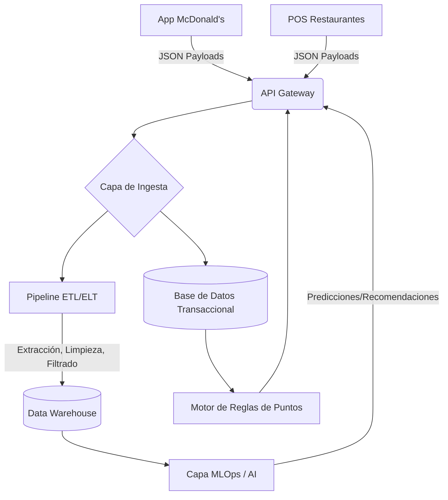
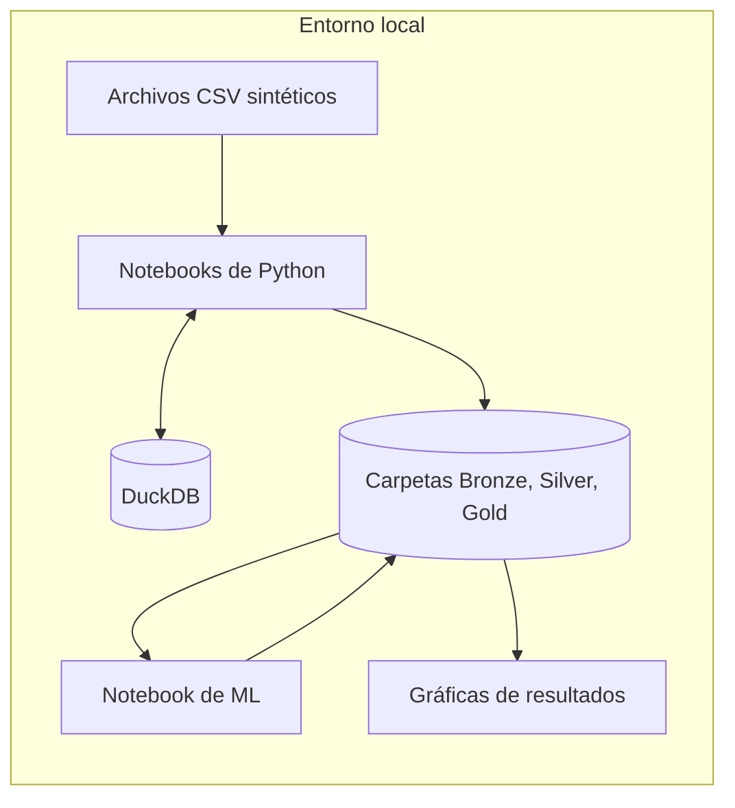
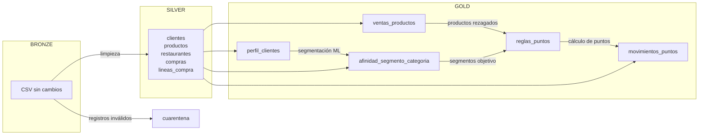
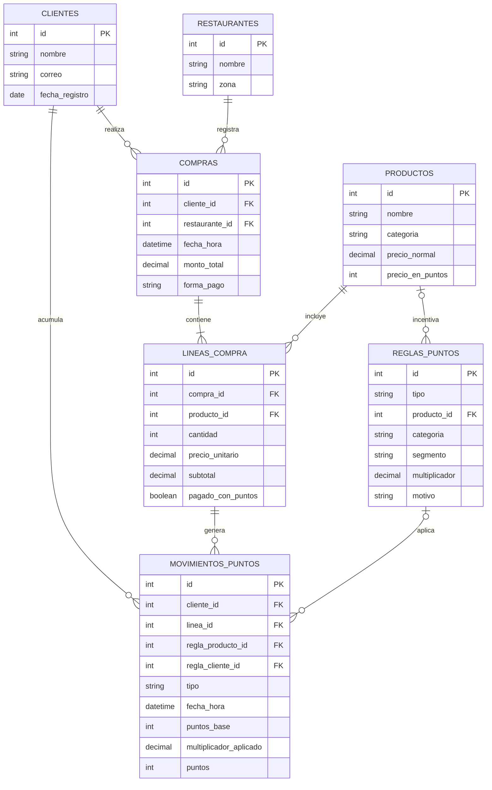

# Caso de Estudio 2: Sistema de Recompensas Dinámico para McDonald's

| Integrante | Carné |
|---|---|
| Nelson García Bravatti | 22434 |
| Ricardo Chuy | 221007 |
| Diego Valenzuela | 22309 |
| Daniel Dubón | 22233 |
| Sergio Orellana | 221122 |
| Joaquín Puente | 22296 |

---

## 1. Resumen de la situación

**Contexto del proyecto:** en este caso académico asumimos el rol de consultores de McDonald's para analizar su programa de puntos y proponer mejoras. Reconstruimos su funcionamiento a partir de información pública y desarrollamos una prueba de concepto (POC) con datos sintéticos. No tenemos acceso a la infraestructura, transacciones ni modelos internos de la empresa; la arquitectura descrita es una inferencia para el caso de estudio.

### 1.1 Funcionamiento del programa MiMcDonald's

MiMcDonald's es el programa de fidelización integrado en la aplicación de McDonald's Guatemala. Los usuarios registrados participan automáticamente en el programa y disponen de una tarjeta de lealtad digital identificada mediante un código QR y un código de cliente. Al realizar una compra, el cliente debe identificarse antes de procesar el pago para que la transacción pueda asociarse con su cuenta.

El programa funciona bajo un modelo de acumulación y canje de puntos. Los puntos son personales, no transferibles y no poseen valor monetario. Además de recompensas por puntos, el programa contempla ofertas, cupones, promociones geolocalizadas y campañas temporales.

### 1.2 Acumulación de puntos

McDonald's Guatemala establece una acumulación base de 10 puntos por cada Q1.00 gastado. Para montos inferiores o fraccionarios, los puntos se calculan proporcionalmente y los decimales resultantes se aproximan al entero superior. Los puntos solamente se generan después de que el pago haya sido procesado y pueden tardar hasta 24 horas en aparecer en la cuenta.

Por ejemplo:

| Monto elegible | Puntos base |
| :---: | :---: |
| Q10 | 100 |
| Q25 | 250 |
| Q50 | 500 |
| Q100 | 1,000 |

### 1.3 Problemática

Para la comparación usamos una **política base de 10 puntos por Q1**, sin multiplicadores. La tasa base por sí sola no diferencia entre clientes frecuentes, clientes que dejaron de comprar ni productos con baja rotación. Esto plantea tres oportunidades de análisis:

- **Orientar los incentivos:** distinguir entre retención, reactivación y aumento de frecuencia según el comportamiento observado.
- **Impulsar productos rezagados:** comparar cada producto con otros de su categoría para elegir dónde asignar puntos adicionales.
- **Aprovechar el historial:** convertir las transacciones en perfiles, afinidades y reglas explicables.

Proponemos seleccionar multiplicadores a partir de ventas y segmentación con Machine Learning. La existencia de aceleradores ya está contemplada en los términos públicos; el aporte de esta POC es documentar un mecanismo reproducible para decidir **qué productos incentivar y a qué segmentos**, con un tope combinado y trazabilidad por línea. No afirmamos que la empresa carezca de personalización ni que utilice internamente esta arquitectura.

### 1.4 Objetivo y alcance

**Objetivo general:** proponer un sistema de puntos dinámico que ajuste los puntos otorgados según el producto y el comportamiento del cliente, y verificar su funcionamiento mediante un pipeline de datos sintéticos.

**Objetivos específicos:**

1. Inferir la arquitectura tecnológica actual del programa MiMcDonald's.
2. Diseñar un modelo de datos y una arquitectura Medallion que soporten puntos dinámicos.
3. Construir una prueba de concepto local con datos sintéticos.
4. Integrar un modelo de segmentación de clientes que, junto con el análisis de ventas, determine qué productos incentivar y para qué clientes.

**Alcance:** el proyecto se concentra en el **pipeline de datos** y en una comparación contable entre políticas de puntos. La aplicación, los sistemas POS y la API quedan fuera del alcance y se simulan mediante archivos CSV sintéticos. Por simplicidad, la POC se ejecuta en un entorno local; la misma estructura de capas puede trasladarse a una plataforma como Databricks en una implementación productiva.

La simulación usa saldo inicial cero, catálogo fijo y acreditación al terminar cada compra. No implementa topes diarios, vencimientos ni devoluciones. Conserva las mismas compras y canjes al comparar políticas, sin simular una respuesta del cliente a los incentivos. Trabajamos con clientes que tienen historial en la ventana de análisis y categorías que registran ventas. El escenario permite calcular los indicadores sin imputar valores para clientes nuevos o categorías sin compras.

Planteamos una arquitectura Medallion que conecta la preparación de datos, la segmentación y el cálculo de puntos. Utilizamos la prueba de concepto para evaluar la coherencia de las transacciones y explicar la asignación de incentivos.

---

## 2. Arquitectura del sistema

### 2.1 Arquitectura inferida a partir del funcionamiento del programa

A partir del funcionamiento público del programa, planteamos el siguiente esquema de arquitectura. En este diseño, las compras de la app y de los restaurantes llegan a una API central y alimentan una base transaccional y un pipeline analítico. La presencia de API Gateway, Data Warehouse y ML es una hipótesis de diseño, no una descripción verificada de los sistemas de McDonald's.


```mermaid
graph TD
    A[App McDonald's] -->|JSON Payloads| C(API Gateway)
    B[POS Restaurantes] -->|JSON Payloads| C
    C --> D{Capa de Ingesta}
    D --> E[(Base de Datos Transaccional)]
    D --> F[Pipeline ETL/ELT]
    F -->|Extracción, Limpieza, Filtrado| G[(Data Warehouse)]
    G --> H[Capa MLOps / AI]
    E --> I[Motor de Reglas de Puntos]
    I --> C
    H -->|Predicciones/Recomendaciones| C
```

Nuestra prueba de concepto se enfoca en la **parte analítica** de esta arquitectura: el pipeline, el Data Warehouse y la capa de ML. Las fuentes de datos (app y POS) se simulan con archivos CSV, para representar sus transacciones.

### 2.2 Arquitectura de infraestructura de la POC

La arquitectura Medallion es una forma de **organizar los datos por niveles de calidad**, no una tecnología específica. Por eso puede implementarse localmente: cada capa es una carpeta y **DuckDB** funciona como motor de consulta. DuckDB es una base de datos analítica que no necesita servidor ni instalación compleja, lee directamente archivos CSV y Parquet, y permite hacer las transformaciones en SQL, de forma similar a un Data Warehouse.


```mermaid
graph LR
    subgraph LOCAL["Entorno local"]
        CSV["Archivos CSV sintéticos"] --> NB["Notebooks de Python"]
        NB <--> DDB[("DuckDB")]
        NB --> CAP[("Carpetas Bronze, Silver, Gold")]
        CAP --> ML["Notebook de ML"]
        ML --> CAP
        CAP --> RES["Gráficas de resultados"]
    end
```

| Componente | Herramienta | Función |
|---|---|---|
| Datos de origen | Archivos CSV | Simulan las transacciones de McDonald's, un archivo por tabla |
| Capas de datos | Carpetas con archivos CSV y Parquet | Bronze, Silver y Gold, más una carpeta de cuarentena |
| Motor de consulta | DuckDB | Lee, transforma y agrega los datos con SQL |
| Pipeline | Notebooks de Jupyter numerados | Ejecutados en orden, cumplen el papel del orquestador |
| Machine Learning | scikit-learn | Segmentación de clientes con K-means |
| Resultados | Tablas y gráficas en el notebook final | Comparan emisión fija/dinámica y explican productos y segmentos |

**Estructura del proyecto:**

```
Caso-Estudio-2/
├── data/
│   ├── bronze/       ← CSV sintéticos, sin modificar
│   ├── silver/       ← tablas limpias en Parquet
│   ├── gold/         ← tablas de negocio en Parquet
│   └── cuarentena/   ← registros rechazados en la limpieza
├── notebooks/
│   ├── 01_generar_datos
│   ├── 02_bronze_a_silver
│   ├── 03_silver_a_gold
│   ├── 04_segmentacion_ml
│   └── 05_puntos_e_insights
└── requirements.txt
```

Se usa **Parquet** en Silver y Gold porque, a diferencia del CSV, conserva los tipos de dato (fechas, decimales, enteros).

### 2.3 Arquitectura de datos (Medallion)


```mermaid
graph LR
    subgraph BRONZE
        B["CSV sin cambios"]
    end
    subgraph SILVER
        S["clientes<br/>productos<br/>restaurantes<br/>compras<br/>lineas_compra"]
    end
    Q["cuarentena"]
    subgraph GOLD
        G1["perfil_clientes"]
        G2["ventas_productos"]
        G3["afinidad_segmento_categoria"]
        G4["reglas_puntos"]
        G5["movimientos_puntos"]
    end
    B -->|limpieza| S
    B -->|registros inválidos| Q
    S --> G1
    S --> G2
    G1 -->|segmentación ML| G3
    S --> G3
    G2 -->|productos rezagados| G4
    G3 -->|segmentos objetivo| G4
    G4 -->|cálculo de puntos| G5
    S --> G5
```

- **Bronze:** los CSV de origen. Sirve de respaldo para reprocesar si algo falla.
- **Silver:** datos limpios. Se eliminan duplicados, montos negativos, campos vacíos y referencias a productos o clientes inexistentes, y se corrigen los tipos de dato. Los registros rechazados se guardan en `cuarentena` para poder revisarlos.
- **Gold:** tablas para el negocio y el modelo, descritas en detalle en la sección 3.3.

El período de datos se divide en dos ventanas: los **meses 1 y 2** sirven para analizar a los clientes y productos y definir las reglas, y el **mes 3** es donde se aplican. Así reservamos un período distinto para comparar la aplicación de las reglas.

---

## 3. Prueba funcional (POC) del sistema de puntos

### 3.1 Revisión de la base de datos inicial

Propuesta inicial: `clientes` (id, nombre, correo, puntos), `productos` (id, nombre, precio normal, precio con puntos, tipo) y `compras` (id, producto(s), monto total, forma de pago, hora, fecha).

| Problema | Corrección |
|---|---|
| `compras` no tiene `cliente_id`, así que no se sabe a quién asignar los puntos | Agregar `cliente_id` |
| `producto(s)` guarda varios productos en un campo, lo que impide analizar ventas por producto | Crear `lineas_compra`: una compra tiene varias líneas, una por producto |
| `hora` y `fecha` separadas | Unificarlas en `fecha_hora` |
| El saldo de `puntos` no tiene historial | Crear `movimientos_puntos`; el saldo es la suma de los movimientos |
| No hay dónde guardar multiplicadores | Crear `reglas_puntos` |
| No se registra el restaurante | Agregar `restaurante_id` |
| `tipo` es ambiguo | Renombrarlo `categoria` |

### 3.2 Modelo de datos propuesto


```mermaid
erDiagram
    CLIENTES ||--o{ COMPRAS : realiza
    RESTAURANTES ||--o{ COMPRAS : registra
    COMPRAS ||--|{ LINEAS_COMPRA : contiene
    PRODUCTOS ||--o{ LINEAS_COMPRA : incluye
    PRODUCTOS |o--o{ REGLAS_PUNTOS : incentiva
    CLIENTES ||--o{ MOVIMIENTOS_PUNTOS : acumula
    LINEAS_COMPRA ||--o{ MOVIMIENTOS_PUNTOS : genera
    REGLAS_PUNTOS |o--o{ MOVIMIENTOS_PUNTOS : aplica

    CLIENTES {
        int id PK
        string nombre
        string correo
        date fecha_registro
    }
    PRODUCTOS {
        int id PK
        string nombre
        string categoria
        decimal precio_normal
        int precio_en_puntos
    }
    RESTAURANTES {
        int id PK
        string nombre
        string zona
    }
    COMPRAS {
        int id PK
        int cliente_id FK
        int restaurante_id FK
        datetime fecha_hora
        decimal monto_total
        string forma_pago
    }
    LINEAS_COMPRA {
        int id PK
        int compra_id FK
        int producto_id FK
        int cantidad
        decimal precio_unitario
        decimal subtotal
        boolean pagado_con_puntos
    }
    REGLAS_PUNTOS {
        int id PK
        string tipo
        int producto_id FK
        string categoria
        string segmento
        decimal multiplicador
        string motivo
    }
    MOVIMIENTOS_PUNTOS {
        int id PK
        int cliente_id FK
        int linea_id FK
        int regla_producto_id FK
        int regla_cliente_id FK
        string tipo
        datetime fecha_hora
        int puntos_base
        decimal multiplicador_aplicado
        int puntos
    }
```

Las primeras cinco tablas se generan como CSV, se cargan en Bronze y, una vez limpias, pasan a Silver. Las tablas de Gold las **calcula el pipeline**.

### 3.3 Diccionario de datos

Para cada tabla se indica su capa, su **granularidad** (qué representa una fila) y la descripción de cada columna. Los campos marcados como *opcional* pueden quedar vacíos.

#### Capa Silver

**`clientes`**: clientes registrados en MiMcDonald's. Una fila por cliente.

| Columna | Tipo | Descripción |
|---|---|---|
| id | entero | Identificador único del cliente (PK) |
| nombre | texto | Nombre completo |
| correo | texto | Correo electrónico, único por cliente |
| fecha_registro | fecha | Fecha de alta en el programa; anterior a su primera compra |

**`productos`**: catálogo del menú. Una fila por producto.

| Columna | Tipo | Descripción |
|---|---|---|
| id | entero | Identificador único del producto (PK) |
| nombre | texto | Nombre del producto (ej. "Big Mac", "McFlurry Oreo") |
| categoria | texto | Una de: `hamburguesas`, `pollo`, `desayunos`, `acompañamientos`, `bebidas`, `postres`, `ensaladas` |
| precio_normal | decimal | Precio en quetzales, mayor que 0 |
| precio_en_puntos | entero | Puntos necesarios para canjear el producto |

**`restaurantes`**: puntos de venta. Una fila por restaurante.

| Columna | Tipo | Descripción |
|---|---|---|
| id | entero | Identificador único del restaurante (PK) |
| nombre | texto | Nombre del restaurante |
| zona | texto | Zona o municipio donde se ubica |

**`compras`**: encabezado de cada factura. Una fila por compra.

| Columna | Tipo | Descripción |
|---|---|---|
| id | entero | Identificador único de la compra (PK) |
| cliente_id | entero | Cliente que realizó la compra (FK a `clientes`) |
| restaurante_id | entero | Restaurante donde se realizó (FK a `restaurantes`) |
| fecha_hora | fecha y hora | Momento de la compra en hora local de Guatemala, intervalo `[06:00, 23:00)` |
| monto_total | decimal | Total pagado con dinero: suma de los `subtotal` de sus líneas |
| forma_pago | texto | `efectivo` o `tarjeta`. Los canjes con puntos se identifican a nivel de línea |

**`lineas_compra`**: detalle de cada factura. Una fila por producto dentro de una compra.

| Columna | Tipo | Descripción |
|---|---|---|
| id | entero | Identificador único de la línea (PK) |
| compra_id | entero | Compra a la que pertenece (FK a `compras`) |
| producto_id | entero | Producto comprado (FK a `productos`) |
| cantidad | entero | Unidades, mayor o igual a 1 |
| precio_unitario | decimal | Precio cobrado por unidad; 0 si se pagó con puntos |
| subtotal | decimal | `cantidad × precio_unitario` |
| pagado_con_puntos | booleano | Verdadero si la línea fue un canje |

#### Capa Gold

**`perfil_clientes`**: resumen del comportamiento de cada cliente durante la ventana de análisis (meses 1 y 2). Una fila por cliente. Es la entrada del modelo de segmentación.

| Columna | Tipo | Descripción |
|---|---|---|
| cliente_id | entero | Cliente (FK a `clientes`) |
| recencia_dias | entero | Días entre su última compra y la fecha de referencia (último día del mes 2) |
| frecuencia_mensual | decimal | Número de compras dividido entre los meses del período |
| gasto_promedio | decimal | Promedio de `monto_total` de sus compras |
| franja_preferida | texto | Franja con más compras: `mañana` [6,11), `almuerzo` [11,15), `tarde` [15,18), `noche` [18,23). Empates en ese orden |
| categoria_preferida | texto | Categoría con más unidades, incluidos canjes; empates por orden alfabético. Descriptiva: no se usa en el modelo |
| segmento | texto | Segmento asignado por el modelo (sección 4.1) |

**`ventas_productos`**: desempeño de cada producto frente a su categoría durante la ventana de análisis. Una fila por producto.

| Columna | Tipo | Descripción |
|---|---|---|
| producto_id | entero | Producto (FK a `productos`) |
| categoria | texto | Categoría del producto |
| unidades_vendidas | entero | Unidades vendidas con dinero en el período |
| ingresos | decimal | Suma de `subtotal` del producto |
| promedio_categoria | decimal | Promedio de unidades vendidas de los productos de su categoría |
| indice_ventas | decimal | `unidades_vendidas / promedio_categoria`. 1 = vende como el promedio de su categoría |
| es_rezagado | booleano | Verdadero si `indice_ventas` es menor que el umbral de rezago (sección 3.4) |

**`afinidad_segmento_categoria`**: qué tanto compra cada segmento cada categoría durante la ventana de análisis. Una fila por combinación de segmento y categoría.

| Columna | Tipo | Descripción |
|---|---|---|
| segmento | texto | Segmento de clientes |
| categoria | texto | Categoría de productos |
| pct_compras_segmento | decimal | Porcentaje de las compras del segmento que incluyen al menos un producto de la categoría |
| pct_compras_total | decimal | Porcentaje de todas las compras que incluyen al menos un producto de la categoría |
| indice_afinidad | decimal | `pct_compras_segmento / pct_compras_total`. Mayor que 1 = el segmento compra la categoría más que el promedio |

La afinidad incluye líneas monetarias y canjes: mide elección de categoría, no solo ingresos. Una compra puede pertenecer a varias categorías, por lo que los porcentajes no suman necesariamente 100 %. Se mide por categoría y no por producto porque los productos rezagados venden poco por definición: su afinidad individual se calcularía con muy pocas compras y no sería confiable.

**`reglas_puntos`**: multiplicadores de la POC, vigentes durante el mes 3. Una fila por regla. Definimos una ventana común de aplicación para todas las reglas, en lugar de fechas individuales de vigencia.

| Columna | Tipo | Descripción |
|---|---|---|
| id | entero | Identificador único de la regla (PK) |
| tipo | texto | `producto` (aplica a ciertos productos o categorías) o `cliente` (aplica a cualquier compra de un segmento) |
| producto_id | entero | *Opcional.* Producto al que aplica (FK a `productos`) |
| categoria | texto | *Opcional.* Categoría a la que aplica, si la regla no es de un producto específico |
| segmento | texto | *Opcional.* Segmento al que va dirigida. Vacío = todos los clientes |
| multiplicador | decimal | Factor que se aplica sobre los puntos base, mayor que 1 |
| motivo | texto | Justificación de la regla (ej. "producto rezagado con alta afinidad en segmento Leales") |

**`movimientos_puntos`**: historial de puntos de todo el período. Una fila por acumulación o canje, asociada a una línea de compra. En los meses 1 y 2 solo se aplica la regla fija; las reglas dinámicas se aplican a partir del mes 3.

| Columna | Tipo | Descripción |
|---|---|---|
| id | entero | Identificador único del movimiento (PK) |
| cliente_id | entero | Cliente dueño de los puntos (FK a `clientes`) |
| linea_id | entero | Línea de compra que originó el movimiento (FK a `lineas_compra`) |
| regla_producto_id | entero | *Opcional.* Regla de tipo `producto` aplicada (FK a `reglas_puntos`) |
| regla_cliente_id | entero | *Opcional.* Regla de tipo `cliente` aplicada (FK a `reglas_puntos`) |
| tipo | texto | `acumulacion` o `canje` |
| fecha_hora | fecha y hora | Fecha y hora de la compra de origen |
| puntos_base | entero | Puntos con la regla fija: `subtotal × 10`, redondeado hacia arriba por línea. 0 en canjes |
| multiplicador_aplicado | decimal | Producto de los multiplicadores aplicados, limitado por el tope. 1 si no aplica ninguno |
| puntos | entero | Puntos finales, redondeados hacia arriba. Negativo en canjes: `-(precio_en_puntos × cantidad)` |

La diferencia entre `puntos` y `puntos_base`, **solo en acumulaciones del mes 3**, mide la emisión adicional frente a la política fija. Los canjes se comparan por separado y conservan el mismo débito en ambas políticas. Sin margen ni costo por canje, esta diferencia no equivale a un costo monetario.

### 3.4 Parámetros de la POC

| Parámetro | Valor | Uso |
|---|---|---|
| Puntos por quetzal | 10 | Regla base del programa actual |
| Redondeo | Entero superior, por línea | Convención de la POC; la fuente pública no precisa el desglose por línea |
| Umbral de rezago | `indice_ventas` < 0.5 | Un producto vende menos de la mitad del promedio de su categoría |
| Umbral de afinidad | `indice_afinidad` > 1.2 | Un segmento compra la categoría más de 20 % por encima del promedio |
| Tope de multiplicador | x3 | Máximo multiplicador combinado por línea |
| Número de segmentos | 4 | Grupos del modelo K-means |
| Ventana de análisis | Meses 1 y 2 | Datos para perfiles, segmentos, ventas, afinidad y reglas |
| Ventana de aplicación | Mes 3 | Compras a las que se aplican las reglas dinámicas |
| Fecha de referencia | Último día del mes 2 | Base para calcular la recencia |

**Reglas de aplicación:**

- Si varias reglas de tipo `producto` aplican a una línea, se usa la de mayor multiplicador; en empates, la de menor ID.
- Cada cliente recibe como máximo una regla de tipo `cliente`, la de su segmento.
- El multiplicador final es el producto de ambas reglas, sin superar el tope.
- Las líneas pagadas con puntos no generan acumulación. En cada compra se descuentan todos los canjes antes de acreditar los puntos ganados; el saldo inicial del período es cero.

### 3.5 Datos sintéticos

Se genera un CSV por tabla de Silver: `clientes.csv`, `productos.csv`, `restaurantes.csv`, `compras.csv` y `lineas_compra.csv`.

| Tabla | Volumen de la base válida implementada |
|---|---|
| clientes | 1,000 |
| productos | 28, cuatro por categoría |
| restaurantes | 10 |
| compras | 20,000 (3 meses) |
| lineas_compra | 49,525; de 1 a 4 por compra |

Para que la POC tenga sentido, el generador crea los clientes a partir de **cuatro perfiles de comportamiento** que corresponden a los segmentos esperados (sección 4.1):

| Perfil generado | Comportamiento simulado |
|---|---|
| Leales | Varias compras por semana, ticket alto, todas las franjas |
| Madrugadores | Compran casi solo entre 6 y 11 h, sobre todo desayunos y bebidas |
| En riesgo | Compran seguido en el mes 1 y casi nada en el mes 2 |
| Ocasionales | Una o dos compras al mes, ticket bajo |

Las etiquetas de estos perfiles no se exportan. K-means agrupa a los clientes mediante sus variables observadas; después se interpretan los grupos. La coherencia de sus promedios con los patrones simulados valida esta POC, pero no constituye una evaluación supervisada ni demuestra que existan esos grupos en clientes reales.

El generador implementa y valida estas condiciones:

- **Productos rezagados:** cuatro productos con menor probabilidad de selección venden menos de la mitad del promedio de su categoría.
- **Preferencias por categoría:** cada perfil compra algunas categorías más que otras, para que exista afinidad.
- **Canjes coherentes:** solo se generan canjes cuando el cliente tiene saldo suficiente con la regla fija.
- **Registros con errores:** duplicados, montos negativos y productos inexistentes, para demostrar la limpieza en Silver.

La semilla es `22434` y el período sintético va del 1 de enero al 31 de marzo de 2025. Estas fechas organizan el ejercicio y no representan actividad histórica real del programa. Bronze agrega 16 duplicados y dos compras inválidas con sus líneas; Silver conserva los volúmenes válidos de la tabla y cuarentena registra 20 filas rechazadas.

### 3.6 Procedimiento

Cada paso corresponde a un notebook; ejecutarlos en orden equivale a correr el pipeline completo.

1. **Generación (01):** crear los CSV sintéticos en `data/bronze/`.
2. **Silver (02):** limpiar y validar los datos con DuckDB; guardar las tablas limpias en `data/silver/` y los registros rechazados en `data/cuarentena/`.
3. **Gold (03):** con los meses 1 y 2, calcular `perfil_clientes` (sin segmento) y `ventas_productos`.
4. **ML (04):** segmentar a los clientes, completar la columna `segmento` y calcular `afinidad_segmento_categoria` con los meses 1 y 2 (sección 4).
5. **Puntos e insights (05):** generar `reglas_puntos`, calcular `movimientos_puntos` (regla fija en los meses 1 y 2, reglas dinámicas en el mes 3) y comparar ambos sistemas en el mes 3.

**Fórmula por línea de compra:**

> puntos_base = ceil(subtotal × 10)
>
> multiplicador_aplicado = min(multiplicador_producto × multiplicador_cliente, 3)
>
> puntos = ceil(subtotal × 10 × multiplicador_aplicado)

Se multiplica el importe sin redondear y se redondea al final de cada línea. No se multiplica `puntos_base` ya redondeado. Se mantiene la tasa de 10 puntos por quetzal y ningún multiplicador reduce la acumulación. El cálculo por línea es una convención de la simulación.

**Propuesta operativa:** el plazo público de acreditación permite considerar procesamiento por lotes, siempre que su frecuencia, duración y manejo de fallos respeten las 24 horas. La POC acredita al terminar cada compra para reconstruir saldos; no implementa un servicio diario. En producción, el canje requeriría además una validación transaccional del saldo disponible.

### 3.7 Validaciones

Verificamos los siguientes casos durante la generación, la limpieza y el cálculo de puntos. Las siete pruebas adicionales de integridad también presentan resultados satisfactorios.

| # | Caso | Resultado esperado |
|---|---|---|
| 1 | Registros con errores | No llegan a Silver; quedan en cuarentena |
| 2 | Compra de Q50 sin multiplicadores | 500 puntos |
| 3 | Compra de una sola línea de Q12.35, sin multiplicadores | 124 puntos (123.5 redondeado hacia arriba) |
| 4 | Producto rezagado de Q15 con x2 | 300 puntos |
| 5 | Cliente con regla x1.5 que compra un producto con regla x2 | Multiplicador x3 (1.5 × 2), dentro del tope |
| 6 | Combinación que supera el tope (ej. x2 × x2) | Multiplicador limitado a x3 |
| 7 | Línea pagada con puntos | Movimiento de canje negativo; no genera acumulación |
| 8 | Compra de un cliente con regla, realizada en el mes 1 o 2 | Solo recibe los puntos de la regla fija |
| 9 | Saldos | Cada compra financia sus canjes con saldo previo; ninguna de las dos políticas produce saldo negativo |
| 10 | Q12.35 con ×1.5 | 186 puntos: `ceil(123.5 × 1.5)`, sin redondeo intermedio |
| 11 | Reglas superpuestas o sin segmento afín | Mayor multiplicador de producto; desempate por ID; regla general si ninguna afinidad supera 1.2 |
| 12 | Exportación y reejecución | Parquet conserva esquema y contenido; entradas intactas; sin duplicar movimientos |

---

## 4. Integración de ML en el pipeline

### 4.1 Modelo de segmentación

Aplicamos **K-means** (scikit-learn) a la tabla `perfil_clientes` para agrupar clientes con hábitos similares. Utilizamos las siguientes variables:

- recencia (días desde la última compra);
- frecuencia (compras por mes);
- gasto promedio;
- franja preferida.

Antes de entrenar, la franja preferida se convierte en columnas numéricas (una por franja), porque K-means solo trabaja con números. Se estandarizan las columnas y el bloque de franja se pondera por `1/√4 = 0.5`, para que sus cuatro columnas no dominen la distancia por su número.

K-means usa cuatro grupos, semilla `22434` y 20 inicializaciones. Los nombres se asignan mediante reglas reproducibles sobre los promedios: menor frecuencia → Ocasionales; mayor proporción de mañana entre los restantes → Madrugadores; mayor recencia entre los dos restantes → En riesgo; el último → Leales. La categoría preferida apoya la interpretación, sin entrar al entrenamiento:

| Segmento | Comportamiento | Incentivo propio |
|---|---|---|
| Leales | Compran seguido y gastan bien | Ninguno adicional: ya compran seguido, así que solo reciben los multiplicadores de productos rezagados (sección 4.2) |
| Madrugadores | Compran casi solo en la mañana | Tipo `producto`: x2 en categorías de almuerzo (hamburguesas y pollo) |
| En riesgo | Presentan frecuencia intermedia y menor actividad reciente | Tipo `cliente`: x1.5 en cualquier compra |
| Ocasionales | Compran poco | Tipo `cliente`: x1.25 en cualquier compra |

Obtenemos una silueta de **0.4280** con k = 4 y un ARI de **1.0000** frente a diez semillas alternativas. La silueta de k = 6 es mayor (**0.4499**): cuatro segmentos es una elección interpretativa de la POC, no el óptimo de esa métrica. El segmento En riesgo describe recencia y frecuencia; no es un predictor de abandono.

### 4.2 Asignación de multiplicadores

Además del incentivo propio de cada segmento, `reglas_puntos` incluye reglas para los productos rezagados, que se obtienen combinando dos análisis:

1. **Qué productos incentivar:** los marcados como `es_rezagado` en `ventas_productos`. Se comparan dentro de su categoría porque una ensalada no debe medirse contra una hamburguesa.
2. **A quién dirigir el incentivo:** los segmentos cuyo `indice_afinidad` con la categoría del producto supera el umbral. Esto dirige el multiplicador a clientes que ya eligen esa categoría con mayor frecuencia relativa; la hipótesis de que responderán mejor requiere evaluación en un piloto.

Este mecanismo aplica a cualquier segmento. Por ejemplo, si un postre vende poco y los clientes "Leales" compran postres más que el promedio, el x2 de ese postre se dirige a los Leales. Si ningún segmento muestra afinidad con la categoría, la regla se aplica a todos los clientes.

El flujo completo es: **Silver → perfil de clientes → segmentación → afinidad con productos → reglas de puntos → cálculo de puntos**. El modelo propone a quién incentivar y el cálculo aplica los topes, así cada punto se puede explicar.

### 4.3 Insights calculados

| Insight | Pregunta que responde | Tabla de origen |
|---|---|---|
| Perfil de los segmentos | ¿Qué tipos de clientes hay, cuántos son y cómo compran? | `perfil_clientes` |
| Productos rezagados | ¿Qué productos necesitan impulso dentro de su categoría? | `ventas_productos` |
| Afinidad segmento–categoría | ¿A qué clientes conviene dirigir cada incentivo? | `afinidad_segmento_categoria` |
| Emisión adicional del sistema dinámico | ¿Cuántos puntos adicionales otorga frente a la regla fija, y en qué productos y segmentos se concentran? | `movimientos_puntos` |

Estos insights responden **qué productos incentivar y para quién**. Si los incentivos realmente aumentan las ventas no se puede demostrar con datos sintéticos; eso requiere un piloto con clientes reales.

**Resultados de la ejecución completa (semilla 22434):**

| Indicador | Resultado |
|---|---:|
| Clientes por segmento | 250 Leales; 249 Madrugadores; 255 En riesgo; 246 Ocasionales |
| Productos rezagados | 4 de 28 |
| Reglas generadas | 8: seis de producto y dos de cliente |
| Movimientos de enero–marzo | 49,525: 47,030 acumulaciones y 2,495 canjes |
| Emisión fija en marzo | 4,080,306 puntos |
| Emisión dinámica en marzo | 4,271,226 puntos |
| Emisión adicional en marzo | 190,920 puntos, incremento del 4.68 % |
| Puntos canjeados en marzo | 1,417,116 en ambas políticas |
| Clientes con puntos extra | 605 de los 907 activos en marzo |
| Saldo final mínimo | 150 puntos en ambas políticas |

Los rezagados son Hamburguesa especial (índice 0.0635), Sándwich de pollo especial (0.0521), Pie de manzana (0.0343) y Ensalada especial (0.0462). Los primeros tres se incentivan para Leales y el último para En riesgo, según la afinidad de su categoría. Las reglas adicionales de Madrugadores, En riesgo y Ocasionales completan las ocho reglas.

| Segmento | Puntos base en marzo | Puntos dinámicos | Puntos extra | Participación en puntos extra |
|---|---:|---:|---:|---:|
| Leales | 3,024,031 | 3,053,660 | 29,629 | 15.52 % |
| Madrugadores | 819,063 | 882,746 | 63,683 | 33.36 % |
| En riesgo | 142,790 | 216,737 | 73,947 | 38.73 % |
| Ocasionales | 94,422 | 118,083 | 23,661 | 12.39 % |

En riesgo concentra la mayor emisión adicional, seguido de Madrugadores. Esto permite priorizar el control del presupuesto por segmento. Cuarto de libra aporta 24,243 puntos extra, el mayor total por producto: las reglas de cliente y de categoría también incentivan productos que no están rezagados. Por tanto, el costo del programa no debe atribuirse únicamente a los cuatro rezagados.

### 4.4 Propuestas de evolución

- **Escalabilidad:** proponemos migrar el pipeline a una plataforma como Databricks para trabajar con datos reales y a mayor escala.
- **Gestión de modelos:** proponemos registrar y versionar los modelos con MLflow.
- **Incentivos por horario:** planteamos aplicar multiplicadores a productos con pocas ventas en determinadas franjas del día.
- **Rentabilidad:** proponemos incorporar el margen de cada producto para priorizar los rezagados más rentables.
- **Prevención del abandono:** planteamos un modelo que estime el riesgo de que un cliente deje de comprar.
- **Evaluación comercial:** proponemos un piloto con un grupo de control que mantenga la regla fija para medir el impacto real.
- **Comunicación personalizada:** planteamos utilizar un LLM para redactar mensajes sobre los puntos extra.

### 4.5 Indicadores de éxito (en un piloto)

- **Frecuencia de visita:** si los clientes vuelven más seguido.
- **Ticket promedio:** si compran más por visita.
- **Ventas de los productos incentivados:** si los multiplicadores mueven los productos rezagados.
- **Costo en puntos del programa:** si el sistema sigue siendo rentable.

---

### 4.6 Investigación complementaria: DVC y trazabilidad

**DVC (Data Version Control)** es una herramienta de código abierto para relacionar versiones de datos y artefactos de Machine Learning con el código del proyecto. Complementa Git: este conserva archivos pequeños de metadatos (`.dvc`), mientras DVC administra el contenido en una caché local. `dvc add` registra rutas y hashes; un commit puede unir notebook y referencia al dataset exacto. Los datos administrados se excluyen de Git. [Documentación de DVC](https://doc.dvc.org/start).

#### Utilidad en la POC de MiMcDonald's

| Artefacto | Información para versionar | Utilidad para el equipo |
|---|---|---|
| Bronze | CSV de clientes, productos, restaurantes, compras y líneas | Recuperar la simulación original o una variante con otra semilla o patrón de consumo |
| Silver y cuarentena | Datos aceptados y rechazos | Comparar cómo una versión de limpieza cambia la población analizada |
| Gold | Perfiles, ventas, afinidades, reglas y movimientos | Relacionar segmentación y emisión de puntos con las entradas y parámetros exactos |
| Modelo y métricas | Preprocesamiento, K-means, silueta y resultados | Comparar entrenamientos si se añade exportación del modelo; en el escenario actual permanece en memoria |
| Promociones futuras | Calendarios y condiciones comerciales | Explicar diferencias entre campañas; no existe todavía una fuente de promociones en esta POC |

Como aplicación de DVC, planteamos conservar versiones de la simulación con distintas frecuencias de compra de clientes En riesgo. Esto permite comparar grupos, afinidades y puntos extra entre escenarios, y distinguir los efectos de un cambio de datos de los efectos de un cambio del algoritmo.

#### Reproducibilidad del pipeline

`dvc.yaml` declara etapas, comandos, dependencias, parámetros y salidas; `dvc.lock` registra el estado de una ejecución, incluidos hashes y valores de parámetros. Ambos se versionan con Git. `dvc repro` usa esas dependencias para ejecutar las etapas afectadas por cambios. Los comandos pueden ejecutar notebooks mediante `jupyter nbconvert --execute`; no es obligatorio convertirlos a scripts. Las copias ejecutadas deben escribirse aparte del notebook fuente para no modificar la propia dependencia. [Estructura de dvc.yaml y dvc.lock](https://doc.dvc.org/user-guide/project-structure/dvcyaml-files) y [dvc repro](https://doc.dvc.org/command-reference/repro).

La preparación de perfiles y la segmentación actualizan el mismo archivo `perfil_clientes.parquet`. Para integrar DVC, proponemos agrupar ambas operaciones en una etapa Gold/ML o asignarles rutas de salida distintas. Planteamos el flujo generación → limpieza → Gold/ML → puntos y la centralización de semilla, ventanas, k y umbrales en un archivo de parámetros.

DVC no instala el entorno ni garantiza resultados idénticos por sí solo. La reproducción también exige conservar versiones de Python y librerías, semillas, comandos y orden de ejecución. Registramos parte de esas versiones en las ejecuciones, pero `requirements.txt` no fija versiones exactas. La semilla hace deterministas los CSV con la misma configuración; no garantiza igualdad binaria de Parquet entre versiones de las herramientas.

#### Almacenamiento remoto y colaboración

Un remoto DVC guarda los archivos grandes; Git guarda código y metadatos. `dvc push` envía el contenido y `dvc pull` lo recupera. Puede usarse S3, Google Cloud Storage, Azure, Google Drive, SSH o una carpeta local/de red. Cada integrante necesita acceso al mismo almacenamiento; las credenciales particulares se configuran fuera de Git, por ejemplo con `--local`. DVC también ofrece versionamiento local sin un remoto; el remoto aporta respaldo y distribución.

Como el repositorio abarca todo el curso, proponemos inicializar DVC dentro de `Caso-Estudio-2` con `dvc init --subdir` para aislar su configuración.

**Procedimiento de adopción propuesto:**

1. Instalar DVC e inicializar el subproyecto. Migrar deliberadamente los datos que hoy están en Git: dejar de seguirlos con `git rm --cached` conservando los archivos locales. Esto no elimina copias de commits anteriores.
2. Para una primera estrategia de instantáneas, registrar `data/` con `dvc add data` y guardar `data.dvc`, las exclusiones y la configuración junto al código en Git.
3. Configurar un almacenamiento compartido con `dvc remote add -d`, cargarlo con `dvc push` y compartir el commit de Git. Los compañeros recuperan el código y ejecutan `dvc pull`.
4. Ante cambios de datos, actualizar la referencia con `dvc add data` y crear otro commit. Al volver a un commit anterior, `dvc checkout` restaura desde la caché; `dvc pull` recupera lo que falte del remoto.
5. Si se adopta el pipeline por etapas, sustituir el seguimiento global de `data/` por salidas separadas en `dvc.yaml`, evitando registrar dos veces las mismas rutas.

**Criterio de adopción:** mantenemos Git y la ejecución secuencial para el escenario actual, que utiliza datos pequeños y sintéticos. Planteamos DVC como una extensión de MLOps para conservar varias simulaciones, incorporar datos reales o compartir modelos. Su integración requiere configurar el seguimiento de datos y el almacenamiento. En una migración a Databricks, también proponemos definir qué versiones de tablas y artefactos conservar, ya que Delta, MLflow y DVC cubren necesidades complementarias de trazabilidad.

### 4.7 Relación con CRISP-DM

| Fase | Evidencia en el proyecto |
|---|---|
| Comprensión del negocio | Tasa base, oportunidades, alcance y métricas del piloto (secciones 1 y 4.5) |
| Comprensión de los datos | Modelo, diccionario y patrones sintéticos (sección 3; notebook 01) |
| Preparación | Limpieza, cuarentena y agregados (notebooks 02–03) |
| Modelado | K-means, interpretación y afinidad (notebook 04) |
| Evaluación | Diagnóstico de grupos, pruebas de puntos y comparación de políticas (04–05) |
| Despliegue | Exportación local a Gold; integración productiva y piloto propuestos en 4.4–4.5 |

---

## 5. Conclusiones

1. La tasa base de Q1 = 10 puntos sirve como comparación. La POC muestra cómo asignar puntos adicionales por producto y segmento; si esos incentivos modifican el consumo requiere evidencia de un piloto.
2. La arquitectura Medallion es una forma de organizar los datos, independiente de la tecnología. Implementarla localmente con carpetas y DuckDB mantiene la POC simple, y la misma estructura puede migrarse a una plataforma como Databricks.
3. Incorporamos el cliente en cada compra, las líneas de detalle, el historial de puntos y las reglas. Esta estructura permite atribuir cada movimiento a un cliente y medir la emisión por producto.
4. La combinación de ventas por categoría y afinidad entre segmentos y categorías permite decidir qué productos incentivar y a quién, con una segmentación simple con K-means y consultas de agregación.
5. Una integración productiva debe conciliar el cálculo analítico con la disponibilidad transaccional del saldo, el plazo de acreditación y las restricciones comerciales. La POC documenta estas diferencias de alcance.
6. Separar una ventana de análisis y una de aplicación evita que las reglas se evalúen sobre las mismas compras que las originaron.
7. Con datos sintéticos, la POC demuestra que el pipeline funciona y qué incentivos asignar. El impacto real en ventas debe confirmarse con un piloto.
8. La política dinámica emite 190,920 puntos adicionales en marzo (+4.68 %), sin modificar los canjes observados ni producir saldos negativos. Esta cifra dimensiona la emisión de la simulación, no su rentabilidad.
9. DVC permite asociar código y datos de diferentes simulaciones y compartir sus artefactos. Planteamos su adopción como una extensión para fortalecer la reproducibilidad y la colaboración.

---

## 6. Referencias

- Databricks. (s. f.). *What is a medallion architecture?* https://www.databricks.com/glossary/medallion-architecture
- Hughes, A. M. (2012). *Strategic database marketing* (4.ª ed.). McGraw-Hill.
- Kimball, R., & Ross, M. (2013). *The data warehouse toolkit: The definitive guide to dimensional modeling* (3.ª ed.). Wiley.
- McDonald's Guatemala. (s. f.). [*Términos y condiciones del programa MiMcDonald's*](https://mcdonaldsdigital.com/GML/public/app/gt/terminos-y-condiciones). Consulta: 27 de septiembre de 2026.
- Pedregosa, F., et al. (2011). Scikit-learn: Machine learning in Python. *Journal of Machine Learning Research, 12*, 2825–2830.
- Raasveldt, M., & Mühleisen, H. (2019). DuckDB: An embeddable analytical database. *Proceedings of the 2019 International Conference on Management of Data (SIGMOD)*, 1981–1984.
- DVC. (s. f.). [*Get started*](https://doc.dvc.org/start), [*Remote storage*](https://doc.dvc.org/user-guide/data-management/remote-storage), [*dvc.yaml files*](https://doc.dvc.org/user-guide/project-structure/dvcyaml-files), [*repro*](https://doc.dvc.org/command-reference/repro) e [*init*](https://origin-doc.dvc.org/command-reference/init). Consulta: 27 de septiembre de 2026.

## 7. Repositorio y reproducción

Repositorio: [SergioAle210/ML-Engineering](https://github.com/SergioAle210/ML-Engineering).
El caso se encuentra en `Casos-Estudio/Caso-Estudio-2/`. La [guía de ejecución](README.md) reúne la preparación del entorno, el orden de ejecución y las salidas.
